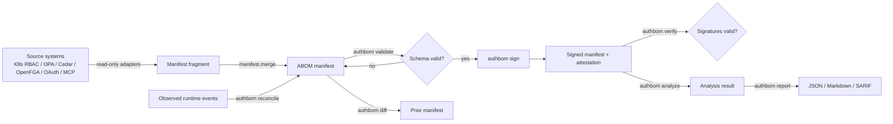

# ABOM Architecture

## Workflow



This mirrors the assignment's candidate workflow (Discover -> Normalize -> Compute -> Attest ->
Observe -> Reconcile -> Analyze -> Revoke -> Verify), scoped to what is actually implemented:
adapters perform discovery+normalization, `analyze` performs compute (effective permissions,
delegation, drift, toxic combinations, revocation convergence), `sign`/`verify` perform
attest/verify, `reconcile` folds in observed runtime evidence. Revocation itself (calling out to
a source system to actually revoke access) is out of scope -- ABOM records revocation state and
its propagation lag; it does not perform revocation.

## Package layout

```
src/authbom/
├── manifest.py          Load/save/validate/merge; new_manifest() skeleton
├── signing.py            HMAC-SHA256 sign/verify (Ed25519/ECDSA schema-allowed, not implemented)
├── cli.py                 9 subcommands: import, generate, validate, sign, verify, diff,
│                           analyze, reconcile, report
├── adapters/
│   ├── synthetic.py       Deterministic synthetic topology + ground-truth generator
│   ├── k8s_rbac.py        Kubernetes RBAC fixture -> manifest fragment
│   ├── opa.py              OPA policy-metadata fixture -> manifest fragment
│   ├── relationship_engines.py   Cedar / OpenFGA fixture -> manifest fragment
│   ├── oauth.py            OAuth scope/delegation-record fixture -> manifest fragment
│   └── mcp.py              MCP tool-capability inventory fixture -> manifest fragment
├── engine/
│   ├── effective_permissions.py   RQ1: naive vs. attenuation-corrected closure + scoring
│   ├── delegation.py               RQ2: chain reconstruction + consistency validation
│   ├── drift.py                    RQ3: scope/revocation-lag/dormant-grant drift detection
│   ├── toxic.py                    RQ4: approver/executor separation-of-duty overlap
│   ├── revocation.py               RQ5: convergence-time measurement
│   └── graph_checks.py             Orphan identities, cross-tenant reachability
└── reporters/
    ├── json_reporter.py, markdown_reporter.py, sarif_reporter.py
```

## Design principles carried from docs/threat_model.md

- Every adapter is read-only and credential-free; none connects to a live system.
- Missing/unverifiable evidence is always surfaced (`evidenceCompleteness: partial|missing`),
  never silently treated as either "access granted" or "no access."
- Signatures cover the full grant payload (canonical JSON, sorted keys) so tampering with any
  field invalidates the signature; replaying one grant's signature onto another's payload fails
  verification because the HMAC is computed over the entire grant, not just its id.
